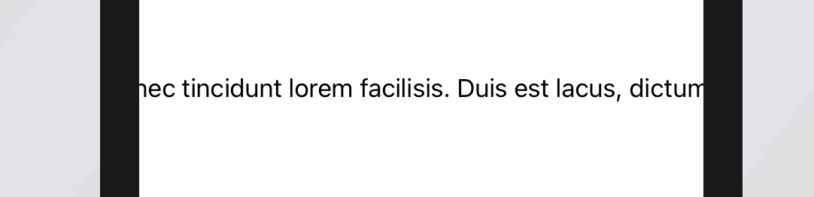

# SampleLabel

## Prime Objective

Display a multi-line `NSAttributedString` in SwiftUI

## What Have I Done So Far

Search around the web and implemented a `UIViewRepresentable`:

```swift
struct AttributedText: UIViewRepresentable {

  var text: NSAttributedString

  func makeUIView(context: Context) -> UILabel {
    let label = UILabel()
    label.numberOfLines = 0
    label.lineBreakMode = .byWordWrapping
    return label
  }

  func updateUIView(_ label: UILabel, context: Context) {
    label.attributedText = text
  }
}
```

## What Is The Problem?



The label shows only one, long line of text. A UITest to check for the correct behavior is included

Any idea what I could do?
